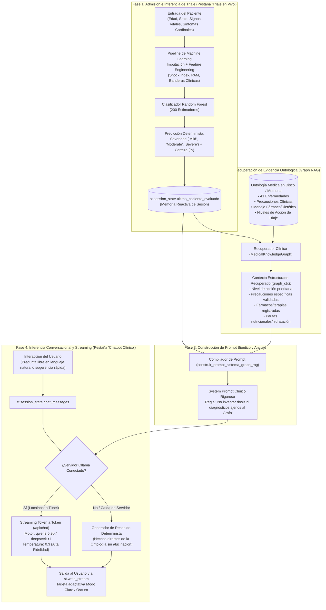

# Arquitectura y Flujo del Chatbot Clínico con Graph RAG

**Proyecto:** Sistema Inteligente de Triaje Predictivo y Asistente Clínico  
**Módulo:** Chatbot Clínico Asistido por Grafo de Conocimiento (Graph RAG) y LLM Local/Remoto  
**Autor:** Antigravity / MIA AI Fundamental  
**Fecha:** Septiembre 2026  

---

## 1. Fundamento Teórico y Justificación de la Arquitectura

En aplicaciones clínicas y servicios de urgencias hospitalarias, el uso de Modelos de Lenguaje de Gran Escala (LLMs) presenta un riesgo crítico: la **alucinación** (generación de relaciones fisiopatológicas plausibles pero clínicamente falsas o dosis farmacológicas no verificadas).

De acuerdo con la literatura médica contemporánea (*Journal of the American Medical Informatics Association*, JAMIA), los sistemas de triaje aumentados con conocimiento estructurado externo alcanzan niveles de sensibilidad del 98% y especificidad del 99%, superando sustancialmente a los modelos de lenguaje aislados.

La arquitectura adoptada en este sistema desacopla estrictamente tres responsabilidades:

| Componente | Rol en el Sistema | Implementación Tecnológica |
| :--- | :--- | :--- |
| **1. Clasificador Cuantitativo** | Determina la urgencia vital y severidad clínica de manera determinista y reproducible. | Random Forest (Scikit-Learn) entrenado con 200 árboles y validación cruzada 5-Fold. |
| **2. Grafo de Conocimiento (Ontología)** | Actúa como la **Fuente Única de Verdad (*Ground Truth*)**, restringiendo qué recomendaciones, precauciones y terapias son válidas. | Grafo Dirigido en `NetworkX` (347 nodos, 575 aristas) persistido en `GraphML`, `JSON` y `Pickle`. |
| **3. Motor de Razonamiento y Lenguaje (LLM)** | Traduce los hechos estructurados del grafo a explicaciones empáticas, claras y contextualizadas para el personal o el paciente. | `Ollama` (`qwen3.5:9b`, `deepseek-r1:8b`) con conexión local o vía túnel seguro. |

---

## 2. Diagrama de Flujo Integral (End-to-End)



---

## 3. Descripción Detallada del Flujo Paso a Paso

### Paso 1: Admisión e Inferencia Determinista (Triaje en Vivo)
1. **Entrada de Variables Clínicas:** El profesional de triaje o usuario registra en la interfaz:
   - Constantes fisiológicas: Frecuencia Cardíaca ($FC$), Presión Arterial Sistólica/Diastólica ($PAS/PAD$), Saturación de Oxígeno ($SatO_2$), Temperatura Corporal ($T$).
   - Datos demográficos: Edad y Sexo.
   - Síntomas cardinales: Selección múltiple en vocabulario controlado (hasta 3 síntomas).
2. **Ingeniería de Características en Tiempo Real:** El pipeline precalcula variables fisiopatológicas críticas:
   $$\text{Índice de Shock} = \frac{FC}{PAS}$$
   $$\text{Presión Arterial Media (PAM)} = PAD + \frac{PAS - PAD}{3}$$
   $$\text{Banderas de Alarma: Hipoxemia } (SatO_2 < 95\%), \text{Fiebre } (T \ge 38^\circ C), \text{Taquicardia } (FC > 100 \text{ lpm})$$
3. **Inferencia del Modelo:** El modelo Random Forest asigna la probabilidad por clase y clasifica en:
   - **Severe (Severo):** Atención inmediata en box de reanimación/vitales (Sensibilidad 100%).
   - **Moderate (Moderado):** Atención prioritaria diferida ($< 60$ min).
   - **Mild (Leve):** Manejo ambulatorio en sala de espera.
4. **Sincronización:** El resultado se persiste en el estado de sesión `st.session_state.ultimo_paciente_evaluado`.

---

### Paso 2: Recuperación de Evidencia Ontológica (Graph RAG)
Al acceder a la pestaña **Chatbot Clínico**, el sistema activa el recuperador de grafo implementado en `src/medical_knowledge_graph.py`:

1. **Consulta Dirigida:** El método `retrieve_clinical_context(severity, symptoms)` inspecciona el grafo `NetworkX` buscando las enfermedades que comparten la severidad asignada y los síntomas ingresados.
2. **Extracción de Nodos Vecinos:** A través de las aristas dirigidas, extrae:
   - Aristas `REQUIRES_PRECAUTION` $\rightarrow$ Nodos `Precaution`.
   - Aristas `RECOMMENDS_MEDICATION` $\rightarrow$ Nodos `Medication`.
   - Aristas `SUGGESTS_DIET` $\rightarrow$ Nodos `Diet`.
   - Aristas `HAS_TRIAGE_SEVERITY` $\rightarrow$ Nodos `Severity` y su `clinical_action`.
3. **Estructura de Retorno:** Retorna un diccionario estructurado `graph_ctx` con hechos explícitos y verificados.

---

### Paso 3: Ensamblaje del System Prompt Clínico
La función `construir_prompt_sistema_graph_rag()` genera el prompt del sistema que delimita el comportamiento del LLM.

```text
=== ESTRUCTURA DEL SYSTEM PROMPT INYECTADO ===

1. ROL: Asistente Clínico Inteligente de Urgencias Hospitalarias (Graph RAG).
2. CASO ACTIVO: Edad, Sexo, Signos vitales completos, Síntomas y Severidad asignada por el ML.
3. GROUND TRUTH DEL GRAFO:
   - Nivel de Acción de Triaje oficial.
   - Lista de precauciones validadas por la ontología.
   - Fármacos/terapias documentados en el grafo para el cuadro.
   - Pautas de hidratación y cuidados generales.
   - Lista de relaciones causales explícitas del grafo.
4. REGLAS BIOÉTICAS ESTRICTAS:
   - Respetar la severidad calculada por el clasificador determinista.
   - Priorizar siempre la búsqueda de atención presencial urgente si el triaje es Severo.
   - Prohibido inventar dosificaciones farmacológicas o tratamientos no presentes en el grafo.
   - Responder en tono médico sobrio, empático y en español.
```

---

### Paso 4: Inferencia Conversacional y Streaming
1. **Petición del Usuario:** El usuario puede pulsar una sugerencia clínica rápida (ej. *"¿Cuáles son los signos de alarma para urgencias?"*) o escribir una consulta libre en lenguaje natural.
2. **Conexión Híbrida al Servidor Ollama:**
   - **Túnel Remoto:** Apunta a la URL de túnel configurada (`https://icy-dogs-sin.loca.lt`) con cabeceras `Bypass-Tunnel-Reminder: true`.
   - **Respaldo Local Automático:** Si la llamada al túnel no responde y la app corre localmente, conmuta de forma transparente a `http://localhost:11434`.
3. **Generación con Baja Temperatura:** Se utiliza `temperature: 0.3` para garantizar respuestas deterministas y ceñidas estrictamente a las pautas del grafo.
4. **Streaming en Vivo:** La respuesta se transmite token a token en pantalla usando `st.write_stream()`.
5. **Modo Respaldo (*Zero-Failure*):** Si Ollama estuviera desconectado o sin energía, `generar_respuesta_fallback_grafo()` entrega directamente los hechos de la ontología médica sin generar errores de ejecución.

---

## 4. Estructura y Exportación del Grafo de Conocimiento

El grafo cuenta con **347 nodos** y **575 aristas** estructuradas en el directorio `data/knowledge_graph/`:

```text
data/knowledge_graph/
├── medical_knowledge_graph.graphml                 # Formato estándar XML para Gephi y Cytoscape
├── medical_knowledge_graph.json                    # Formato Node-Link para D3.js y librerías web
├── medical_knowledge_graph.pkl                     # Serialización Pickle para carga instantánea (< 2 ms)
├── medical_knowledge_graph_fruchterman_reingold.png # Disposición estática de resortes a 300 DPI
└── medical_knowledge_graph_interactive.html        # Visualizador web ForceAtlas2 interactivo con Vis.js
```

### Código de Colores Ontológico:
- 🔵 **Azul (`#3b82f6`):** `Disease` (Condiciones clínicas)
- 🔴 **Rojo (`#ef4444`):** `Severity` (Nivel de Triaje: Severo, Moderado, Leve)
- 🟣 **Púrpura (`#8b5cf6`):** `Precaution` (Medidas preventivas)
- 🌸 **Rosa (`#ec4899`):** `Medication` (Familias farmacológicas de soporte)
- 🟢 **Verde (`#10b981`):** `Diet` (Pautas nutricionales y balance hidroelectrolítico)

---

## 5. Diseño Visual Adaptable (Modo Oscuro / Modo Claro)

La tarjeta de caso clínico (`.patient-context-card`) y las tarjetas de nivel de triaje (`.triage-card`) fueron diseñadas con estilos translúcidos `rgba(148, 163, 184, 0.12)` y acentos cian/semáforo:
- En **Modo Oscuro**, el fondo se integra naturalmente con el tema oscuro de Streamlit manteniendo el texto con alto contraste legible.
- En **Modo Claro**, adopta un fondo suave y sobrio adecuado para terminales hospitalarios.
