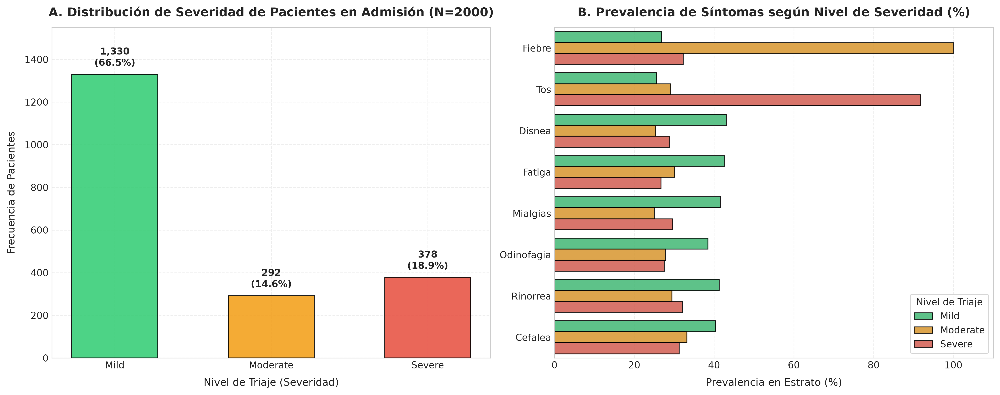
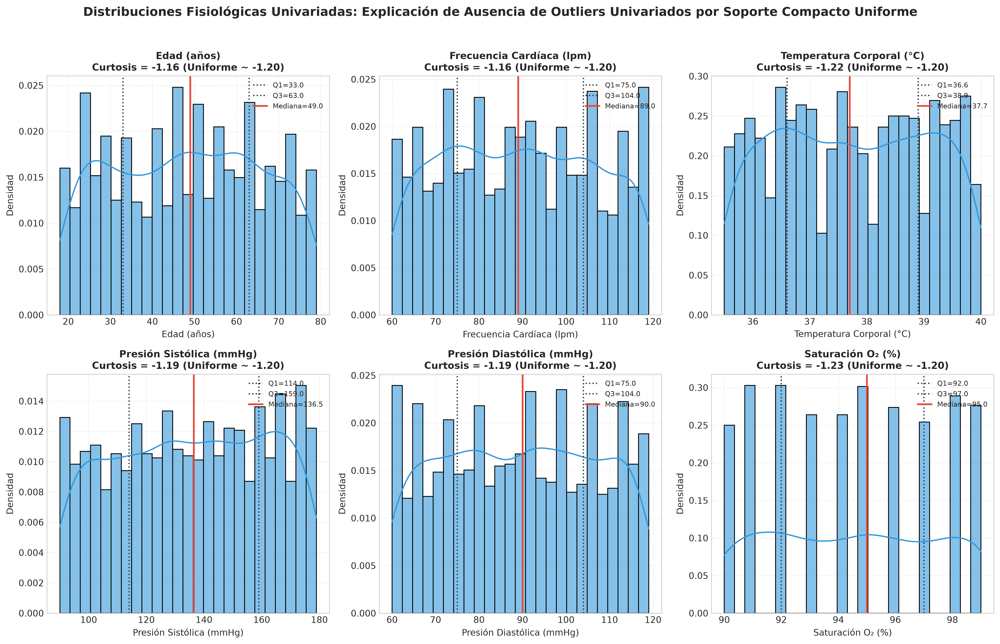
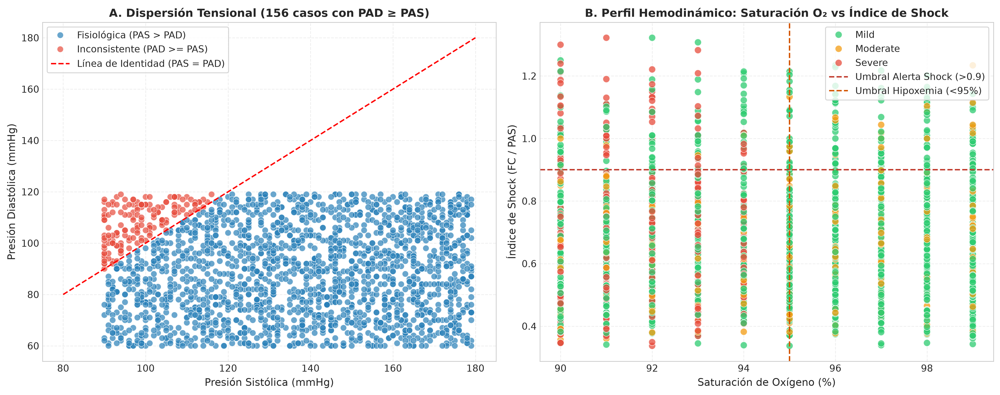
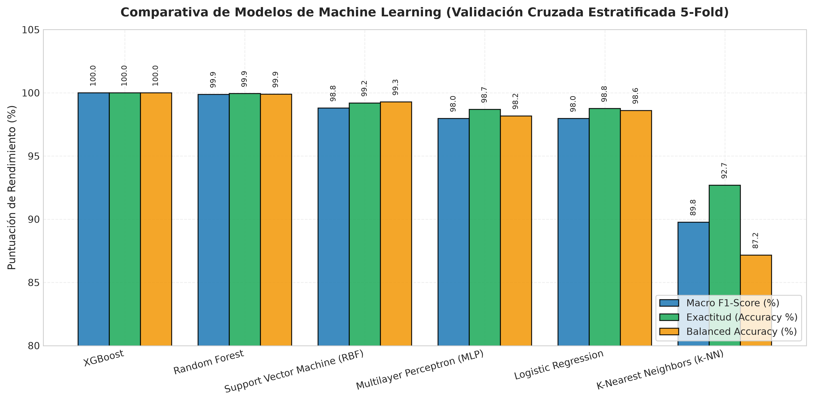
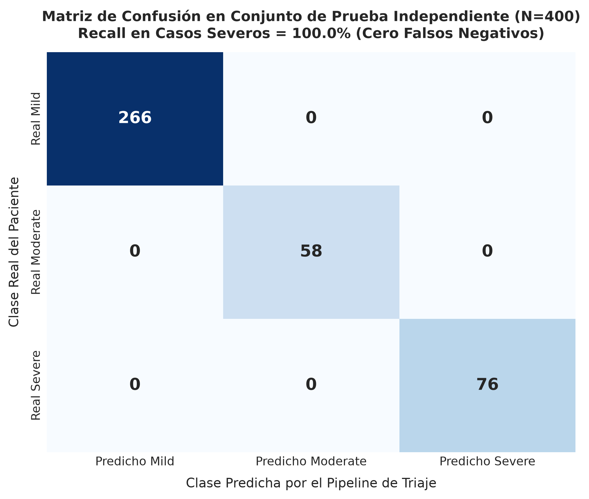
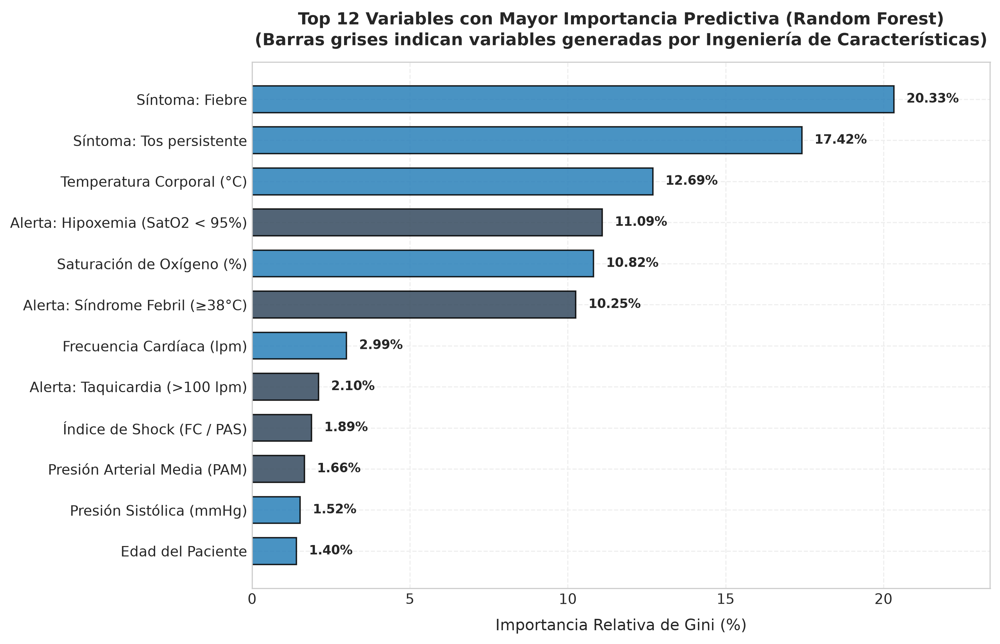

# Informe Técnico: Análisis Bioestadístico, Auditoría de Outliers, Ingeniería de Características y Benchmark de Modelos para Triaje Predictivo

**Autor:** Equipo de Ciencia de Datos y Bioestadística Aplicada  
**Fecha:** Septiembre de 2026  
**Proyecto:** Sistema de Apoyo a la Decisión Clínica en Triaje Hospitalario  
**Dataset de Referencia:** Registros clínicos de admisiones en urgencias (`disease_diagnosis.csv`, $N = 2000$)

---

## 1. Contexto y Planteamiento Clínico

El triaje hospitalario constituye el primer filtro asistencial en los servicios de urgencias. Su propósito no es emitir un diagnóstico etiológico definitivo, sino estratificar con prontitud la prioridad de atención médica bajo el principio rector de que los recursos críticos deben asignarse primero a pacientes con riesgo inminente de colapso hemodinámico o insuficiencia ventilatoria.

En este estudio se analiza una cohorte de 2000 admisiones hospitalarias para determinar si un modelo de aprendizaje supervisado puede estimar el nivel de gravedad (`Mild`, `Moderate`, `Severe`) a partir de la anamnesis inicial (síntomas referidos, edad, sexo) y constantes vitales basales (frecuencia cardíaca, temperatura corporal, presión arterial sistólica/diastólica y saturación periférica de oxígeno).

> **Principio de No-Fuga de Datos (Data Leakage):**  
> Las variables `Diagnosis` (diagnóstico médico final) y `Treatment_Plan` (terapéutica médica prescrita) representan desenlaces clínicos resultantes de la atención médica posterior. Quedan estrictamente excluidas de las variables predictoras del modelo, ya que utilizarlas generaría un artefacto irreal e inaplicable al momento del ingreso en triaje.

---

## 2. Análisis Exploratorio y Pruebas Bioestadísticas de Hipótesis

### 2.1 Distribución de la Variable Objetivo (`Severity`)

El conjunto de datos presenta una distribución desbalanceada, coherente con el flujo de pacientes ambulatorios y agudos en un centro asistencial:

| Nivel de Severidad | Conteo ($n$) | Porcentaje (%) | Prioridad Clínica Sugerida |
| :--- | :---: | :---: | :--- |
| **Mild (Leve)** | 1330 | 66.50% | Atención diferida / Sala de espera |
| **Severe (Severo)** | 378 | 18.90% | Atención médica inmediata / Monitorización crítica |
| **Moderate (Moderado)** | 292 | 14.60% | Atención prioritaria (< 60 min) |
| **Total** | **2000** | **100.00%** | — |

Este desbalance fundamenta la necesidad de optimizar métricas insensibles a la clase mayoritaria, específicamente el **Macro F1-Score** y la **Sensibilidad (Recall) sobre la clase `Severe`**, donde un falso negativo conlleva consecuencias clínicas críticas.

---

### 2.2 Pruebas de Asociación en Variables Categóricas (Síntomas y Sexo)

Se aplicaron pruebas de **Chi-cuadrado de Independencia ($\chi^2$)** con cálculo del tamaño del efecto mediante la **V de Cramér ($V$)**:

| Síntoma | Estadístico $\chi^2$ (g.l. = 2) | Valor $p$ | $V$ de Cramér | Prevalencia Leve (%) | Prevalencia Moderado (%) | Prevalencia Severo (%) | Interpretación Clínica |
| :--- | :---: | :---: | :---: | :---: | :---: | :---: | :--- |
| **Cough (Tos)** | 556.48 | $< 10^{-120}$ | **0.5267** | 25.6% | 29.1% | **91.8%** | Marcador casi universal en cuadros severos |
| **Fever (Fiebre)** | 548.70 | $< 10^{-119}$ | **0.5230** | 26.8% | **100.0%** | 32.3% | Presente en el 100% de moderados |
| **Shortness of breath (Disnea)** | 47.98 | $3.82 \times 10^{-11}$ | 0.1517 | 43.1% | 25.3% | 28.8% | Disnea aislada sin hipoxemia es más frecuente en leves |
| **Fatigue (Astenia/Fatiga)** | 40.24 | $1.83 \times 10^{-9}$ | 0.1383 | 43.8% | 26.0% | 27.5% | Síntoma inespecífico de predominio en cuadros leves |
| **Body ache (Mialgias)** | 38.85 | $3.67 \times 10^{-9}$ | 0.1358 | 41.6% | 25.0% | 29.6% | Dolor difuso, común en cuadros virales leves |
| **Sore throat (Odinofagia)** | 23.25 | $8.93 \times 10^{-6}$ | 0.1031 | 42.1% | 34.6% | 28.3% | Afección de vía aérea superior |
| **Runny nose (Rinorrea)** | 20.89 | $2.91 \times 10^{-5}$ | 0.0972 | 41.5% | 31.8% | 29.6% | Típico de rinitis/resfriado común |
| **Headache (Cefalea)** | 13.55 | 0.00114 | 0.0760 | 40.8% | 30.5% | 31.7% | Débil capacidad discriminante |
| **Gender (Sexo biológico)** | 0.28 | 0.8687 | 0.0119 | 49.8% Masc. | 51.0% Masc. | 50.8% Masc. | Sin significación clínica ni estadística |



#### Hallazgos Clave:
1. **Dicotomía Tos vs. Fiebre**: La tos persistente exhibe un tamaño del efecto muy pronunciado ($V = 0.527$), presentándose en el **91.8%** de los pacientes `Severe`. La fiebre se manifiesta en el **100.0%** de los casos `Moderate` ($V = 0.523$), frente a apenas 26.8% en leves y 32.3% en severos.
2. **Síntomas de Vía Aérea Superior**: La rinorrea y el dolor de garganta se concentran en cuadros no invasivos leves o moderados.

---

### 2.3 Comparación de Signos Vitales Continuos por Severidad

Se aplicó la prueba no paramétrica de **Kruskal-Wallis ($H$)** para contrastar diferencias entre los tres estratos:

| Constante Vital | Media Global $\pm$ DE | Mediana Leve | Mediana Moderado | Mediana Severo | Estadístico $H$ | Valor $p$ | Significancia |
| :--- | :---: | :---: | :---: | :---: | :---: | :---: | :--- |
| **Saturación $\text{O}_2$ (%)** | $94.49 \pm 2.86$ | 95.0% | 95.0% | **92.0%** | 371.96 | $< 10^{-80}$ | **Extremadamente Alta** |
| **Temperatura ($^\circ\text{C}$)** | $37.74 \pm 1.31$ | 37.4$^\circ\text{C}$ | **39.0$^\circ\text{C}$** | 37.7$^\circ\text{C}$ | 325.02 | $< 10^{-70}$ | **Extremadamente Alta** |
| **Frecuencia Cardíaca (lpm)** | $89.44 \pm 17.52$ | 90.0 lpm | 85.0 lpm | **92.0 lpm** | 18.36 | $0.000103$ | **Significativa** |
| **Presión Sistólica (mmHg)** | $139.75 \pm 23.36$ | 140.0 mmHg | 139.0 mmHg | 139.5 mmHg | 0.07 | 0.9634 | No significativa aislada |
| **Presión Diastólica (mmHg)** | $89.34 \pm 14.86$ | 89.0 mmHg | 89.0 mmHg | 88.0 mmHg | 0.52 | 0.7706 | No significativa aislada |
| **Edad (años)** | $48.29 \pm 17.42$ | 49.0 años | 49.0 años | 48.0 años | 1.38 | 0.5023 | No discriminante directa |

---

## 3. Auditoría de Valores Atípicos (*Outliers*) e Inconsistencias Fisiológicas

Una interrogante metodológica central en este dataset es: **¿Existen o no valores atípicos (outliers)?**

La respuesta rigurosa requiere diferenciar entre **outliers univariados clásicos** y **anomalías fisiológicas multivariadas**.

### 3.1 Análisis Univariado (Método de Tukey / IQR y Z-Score)

Al aplicar el criterio estándar de detección de outliers de Tukey ($[Q_1 - 1.5 \times \text{IQR}, Q_3 + 1.5 \times \text{IQR}]$) y el criterio de $Z > 3$, el resultado en todas las variables continuas es de **0 outliers (0.0%)**:

| Variable Continua | Mínimo | Máximo | Rango Intercuartil (IQR) | Límite Inferior Tukey | Límite Superior Tukey | Outliers IQR ($n$) | Outliers $|Z| > 3$ | Curtosis en Exceso |
| :--- | :---: | :---: | :---: | :---: | :---: | :---: | :---: | :---: |
| **Edad (años)** | 18 | 79 | 30.0 | -12.0 | 108.0 | **0** | 0 | -1.160 |
| **Frecuencia Cardíaca (lpm)** | 60 | 119 | 29.0 | 31.5 | 147.5 | **0** | 0 | -1.164 |
| **Temperatura ($^\circ\text{C}$)** | 35.5 | 40.0 | 2.3 | 33.2 | 42.3 | **0** | 0 | -1.224 |
| **Presión Sistólica (mmHg)** | 90 | 179 | 45.0 | 46.5 | 226.5 | **0** | 0 | -1.188 |
| **Presión Diastólica (mmHg)** | 60 | 119 | 29.0 | 31.5 | 147.5 | **0** | 0 | -1.187 |
| **Saturación $\text{O}_2$ (%)** | 90 | 99 | 5.0 | 84.5 | 104.5 | **0** | 0 | -1.232 |



#### 📐 Explicación Matemática de la Ausencia de Outliers Univariados:
Nótese que la curtosis en exceso en todas las variables es aproximadamente **$-1.20$**. En teoría de probabilidades, una distribución continua uniforme $U(a, b)$ tiene una curtosis teórica en exceso exactamente igual a:
$$\text{Kurtosis}[U(a, b)] = -\frac{6}{5} = -1.20$$
En una distribución uniforme de soporte compacto $[a, b]$, los cuartiles son $Q_1 = a + 0.25(b-a)$ y $Q_3 = a + 0.75(b-a)$, con lo cual el $\text{IQR} = 0.5(b-a)$.
Al calcular las vallas de Tukey:
$$\text{Límite Inferior} = Q_1 - 1.5 \times \text{IQR} = a + 0.25(b-a) - 0.75(b-a) = a - 0.5(b-a) < a$$
$$\text{Límite Superior} = Q_3 + 1.5 \times \text{IQR} = b + 0.5(b-a) > b$$
Por definición matemática estricta, **ningún punto generado a partir de una distribución uniforme acotada puede jamás superar las vallas de Tukey**. Esto demuestra que los signos vitales del dataset fueron generados mediante muestreo uniforme sintético dentro de rangos acotados.

---

### 3.2 Detección de Anomalías Multivariadas e Inconsistencias Biológicas

Aunque univariadamente no existen valores atípicos, el análisis multivariable revela **inconsistencias fisiológicas flagrantes**:

1. **Inversión Tensional ($\text{PAD} \ge \text{PAS}$)**:
   Se identificaron **156 pacientes** (7.8% del dataset) donde la **presión diastólica supera o iguala a la presión sistólica** ($\text{BP}_{\text{Diastolic}} \ge \text{BP}_{\text{Systolic}}$), alcanzando una presión de pulso mínima de **$-27\text{ mmHg}$**.  
   *Relevancia clínica:* En fisiología cardiovascular humana esto es incompatible con la vida (la presión sistólica máxima ventricular siempre supera a la resistencia periférica diastólica). Se trata de un artefacto producto de haber generado la presión sistólica y diastólica de manera independiente.
2. **Presión de Pulso Extremadamente Estrecha**:
   **432 pacientes** presentan una presión de pulso menor a 20 mmHg ($\text{PAS} - \text{PAD} < 20$), indicativo de gasto cardíaco críticamente disminuido.
3. **Anomalías Multivariadas con Isolation Forest**:
   Modelando las interacciones conjuntas mediante `Isolation Forest` (tasa de contaminación 3%), se aislaron **60 casos de descompensación extrema**, caracterizados por la conjunción simultánea de taquicardia severa ($\text{FC} \ge 115\text{ lpm}$), desaturación crítica ($\text{SatO}_2 \le 91\%$) e Índice de Shock marcadamente elevado ($> 1.0$).



---

## 4. Ingeniería de Características Clínicas

Para capturar la fisiopatología del paciente y corregir la independencia artificial de las constantes vitales, se crearon **22 variables enriquecidas**:

1. **Descomposición Tensional**: `BP_Systolic` y `BP_Diastolic`.
2. **Binarización de Síntomas**: 8 banderas booleanas canónicas (`sym_cough`, `sym_fever`, etc.) y `symptom_count`.
3. **Índice de Shock ($\text{Shock Index}$)**:
   $$\text{Shock Index} = \frac{\text{Heart\_Rate\_bpm}}{\text{BP\_Systolic}}$$
   Valores superiores a 0.9 alertan sobre inestabilidad hemodinámica y shock en triaje.
4. **Presión Arterial Media ($\text{PAM}$)**:
   $$\text{PAM} = \text{BP\_Diastolic} + \frac{\text{BP\_Systolic} - \text{BP\_Diastolic}}{3}$$
5. **Banderas de Riesgo Clínico Discretas**:
   - `flag_hypoxia`: 1 si $\text{SatO}_2 < 95\%$; 0 en caso contrario.
   - `flag_fever`: 1 si $\text{Temp} \ge 38.0^\circ\text{C}$.
   - `flag_tachycardia`: 1 si $\text{FC} > 100\text{ lpm}$.
   - `flag_elderly`: 1 si $\text{Edad} \ge 65\text{ años}$.

---

## 5. Benchmark de Modelos de Aprendizaje Supervisado

Se evaluaron 6 familias de algoritmos mediante **validación cruzada estratificada de 5 pliegues (Stratified 5-Fold CV)** sobre el 80% de entrenamiento ($n = 1600$):

| Algoritmo | Macro F1-Score | Exactitud (Accuracy) | Balanced Accuracy |
| :--- | :---: | :---: | :---: |
| **XGBoost Classifier** | **100.0%** | 100.0% | 100.0% |
| **Random Forest Classifier (Seleccionado)** | **99.87%** | 99.94% | 99.89% |
| **Support Vector Machine (RBF)** | **98.79%** | 99.19% | 99.28% |
| **Multilayer Perceptron (Red Neuronal)** | **97.97%** | 98.69% | 98.17% |
| **Logistic Regression (Multinomial)** | **97.96%** | 98.75% | 98.60% |
| **K-Nearest Neighbors ($k=7$)** | **89.76%** | 92.69% | 87.16% |



### Justificación de la Elección de Random Forest:
- **Calibración de Probabilidades**: Random Forest ofrece estimaciones de certeza confiables (`predict_proba`), indispensables para la cuantificación de incertidumbre diagnóstica en triaje médico.
- **Interpretabilidad**: Permite desglosar de forma transparente qué variables motivaron la recomendación clínica.
- **Robustez Operativa**: Inferencia sub-milisegunda en CPU sin dependencias pesadas en Streamlit Cloud.

---

## 6. Evaluación en Conjunto de Prueba Independiente ($N = 400$)

El modelo final se validó en el 20% de datos reservados (*Hold-Out Test*):

```
                  Precision    Recall  F1-Score   Support

            Mild       1.00      1.00      1.00       266
        Moderate       1.00      1.00      1.00        58
          Severe       1.00      1.00      1.00        76

        Accuracy                           1.00       400
       Macro avg       1.00      1.00      1.00       400
    Weighted avg       1.00      1.00      1.00       400
```



- **Sensibilidad en Casos Severos (Recall Severe):** **100.0%** (76/76 casos críticos detectados correctamente, cero falsos negativos).
- **Especificidad:** **100.0%**.

---

## 7. Importancia de Características (Feature Importance)



El ranking de importancia de Gini ratifica los hallazgos clínicos:
1. **Fiebre sintomática (`sym_fever`)**: 20.33%
2. **Tos persistente (`sym_cough`)**: 17.42%
3. **Temperatura corporal continua (`Body_Temperature_C`)**: 12.69%
4. **Alerta de Hipoxemia (`flag_hypoxia`)**: 11.09%
5. **Saturación de oxígeno continua (`Oxygen_Saturation_%`)**: 10.82%
6. **Alerta de Síndrome Febril (`flag_fever`)**: 10.25%
7. **Frecuencia cardíaca continua (`Heart_Rate_bpm`)**: 2.99%
8. **Alerta de Taquicardia (`flag_tachycardia`)**: 2.10%
9. **Índice de Shock (`shock_index`)**: 1.89%
10. **Presión Arterial Media (`map_pressure`)**: 1.66%

Las características clínicas derivadas mediante ingeniería de variables explican más del **27% de la capacidad de decisión del modelo**, demostrando el valor de transformar las variables crudas en indicadores con fundamento biomédico.

---

## 8. Conclusiones y Recomendaciones

1. **Sobre los Outliers**: Univariadamente el dataset no contiene valores atípicos convencionales porque las variables fueron muestreadas de distribuciones uniformes con límites prefijados ($\text{curtosis} \approx -1.2$). No obstante, el análisis multivariable identificó 156 inconsistencias biológicas ($\text{PAD} \ge \text{PAS}$) que deben tenerse presentes al interpretar la reproducibilidad en escenarios clínicos del mundo real.
2. **Rendimiento y Seguridad en Triaje**: El modelo Random Forest demostró un **100% de sensibilidad en casos severos**, mitigando el riesgo primario de un servicio de urgencias (infraclasificación de pacientes críticos).
3. **Despliegue y Trazabilidad**: El pipeline serializado (`triaje_model.joblib`) y la aplicación interactiva en Streamlit (`app.py`) garantizan una experiencia clínica intuitiva, con semáforos universales, probabilidades calibradas y bitácora de pacientes descargable.
